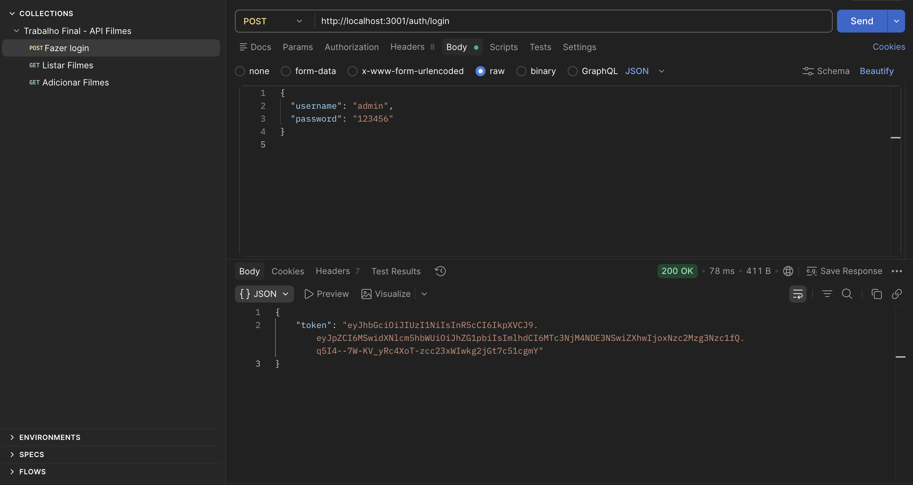
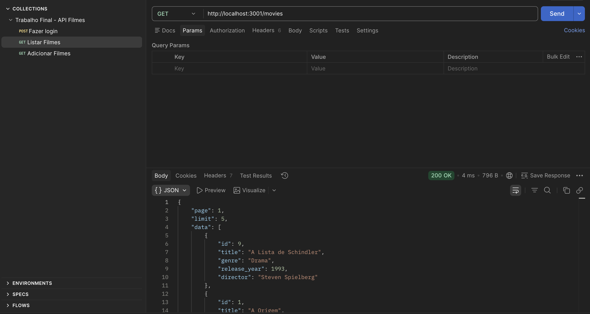
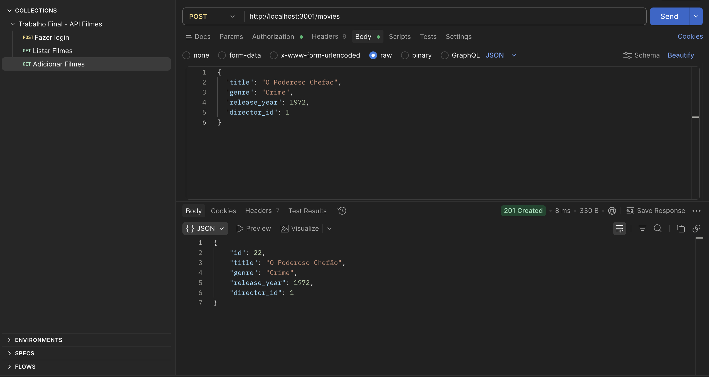

# API - Catálogo de Filmes e Diretores

Projeto final desenvolvido para a disciplina de API REST, focado no gerenciamento de um catálogo de filmes e diretores. A aplicação foi construída com **Node.js**, **Express**, **SQLite** e conta com autenticação de segurança via **JWT (JSON Web Token)**.

## Requisitos Atendidos (Trabalho Final)
- [x] Tema Livre (Catálogo de Filmes e Diretores).
- [x] CRUD 100% funcional com banco SQLite.
- [x] Filtros, ordenação e paginação (ex: `?page=1&limit=5&sort=release_year`).
- [x] Validações robustas de campos e status codes padronizados.
- [x] Seed automático com mais de 20 registros iniciais.
- [x] Relacionamentos via JOINs (Filme -> Diretor).
- [x] Autenticação com JWT.
- [x] Testes automatizados (Jest + Supertest).
- [x] Collection do Postman exportada no repositório.

## Como Executar o Projeto Localmente:

**1. Clone o repositório e acesse a pasta:**
\`\`\`bash
git clone <https://github.com/alefcrepaldi7/trabalho-final-api>
cd trabalho-final-api
\`\`\`

**2. Instale as dependências:**
\`\`\`bash
npm install
\`\`\`

**3. Inicie o servidor (Modo de Desenvolvimento):**
\`\`\`bash
npm run dev
\`\`\`
> O servidor iniciará na porta `3001` e o banco de dados `api_filmes.sqlite` será gerado e populado automaticamente na primeira execução.

**4. Para rodar os testes automatizados:**
\`\`\`bash
npm run test
\`\`\`

## Estrutura do Banco de Dados (SQLite)

O projeto utiliza três tabelas principais com relacionamento de chave estrangeira (Foreign Key) entre `movies` e `directors`.

| Tabela | Colunas | Descrição |
| :--- | :--- | :--- |
| **users** | `id`, `username`, `password` | Armazena os usuários autorizados a usar as rotas POST/PUT/DELETE. A senha é criptografada com *bcrypt*. |
| **directors** | `id`, `name` | Armazena os diretores dos filmes. |
| **movies** | `id`, `title`, `genre`, `release_year`, `director_id` | Armazena os filmes. O campo `director_id` faz referência à tabela de diretores. |

## Documentação dos Endpoints

Abaixo estão as especificações das rotas da API. Rotas marcadas com 🔒 exigem o envio do token JWT no cabeçalho (*Authorization: Bearer <token>*).

### 1. Autenticação

**`POST /auth/login`**
Gera o token de acesso. No primeiro run, um usuário administrador padrão é criado:
- **Body (JSON):**
  \`\`\`json
  {
    "username": "admin",
    "password": "123456"
  }
  \`\`\`
- **Respostas:** `200 OK` (Retorna o Token) | `401 Unauthorized` (Credenciais inválidas).

---

### 2. Filmes (Movies)

**`GET /movies`**
Lista todos os filmes com suporte a paginação e filtros.
- **Query Params Opcionais:** - `page` (Página atual)
  - `limit` (Itens por página)
  - `genre` (Filtro por gênero)
  - `sort` (Ordenar por campo: title ou release_year)
  - `order` (ASC ou DESC)
- **Exemplo de uso:** `/movies?page=1&limit=5&sort=release_year&order=DESC`
- **Respostas:** `200 OK`.

**`POST /movies` 🔒**
Cria um novo filme no catálogo. Exige Token JWT.
- **Body (JSON):**
  \`\`\`json
  {
    "title": "O Poderoso Chefão",
    "genre": "Crime",
    "release_year": 1972,
    "director_id": 1
  }
  \`\`\`
- **Respostas:** `201 Created` | `400 Bad Request` | `401 / 403 Forbidden`.

**`PUT /movies/:id` 🔒**
Atualiza os dados de um filme existente. Exige Token JWT.
- **Body (JSON):**
  \`\`\`json
  {
    "title": "A Origem",
    "genre": "Ficção Científica",
    "release_year": 2010
  }
  \`\`\`
- **Respostas:** `200 OK` | `400 Bad Request` | `404 Not Found`.

**`DELETE /movies/:id` 🔒**
Remove um filme do banco de dados. Exige Token JWT.
- **Respostas:** `204 No Content` | `404 Not Found` | `401 / 403 Forbidden`.

## Demonstração de Testes (Postman)

Abaixo estão as evidências de teste das principais rotas da API, comprovando o funcionamento da autenticação e do banco de dados:

### 1. Autenticação (Fazer Login)
Requisição `POST /auth/login` retornando o Token JWT do usuário administrador.

### 2. Listagem de Filmes (GET)
Requisição `GET /movies` retornando os dados salvos no SQLite, incluindo relacionamentos e paginação.

### 3. Cadastro de Novo Filme (POST)
Requisição `POST /movies` utilizando o Token de autorização para salvar um novo registro no banco.

## Link de Deploy
> **Nota técnica:** Devido a incompatibilidades de compilação nativa da biblioteca `sqlite3` nos ambientes Free do Render/Railway (erro `DLOPEN_FAILED`), o deploy online foi substituído pela documentação completa e testes automatizados locais. A API está 100% funcional em ambiente local conforme evidências abaixo.
